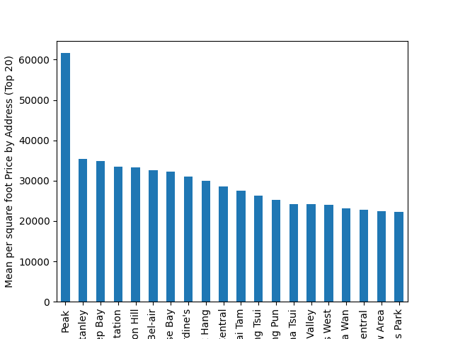
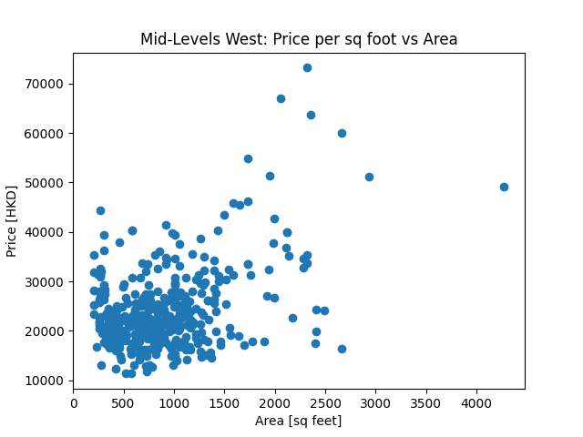

# Hong Kong Housing Price Data Science Project

## Project Overview
This project involved scraping housing information from Centaline Property Agency, a prominent property agent in Hong Kong. The dataset contains details on 10,000 houses, including property names, the number of rooms, addresses, prices in HKD, usable area, gross floor area in square feet, and URLs for more information. The main objectives were to clean the data, visualize the housing market in Hong Kong, and investigate factors influencing house prices.

## Data Collection
- **Source:** Centaline Property Agency
- **Data Points Collected:**
  - Property names
  - Number of rooms
  - Addresses
  - Prices in HKD
  - Usable area (square feet)
  - Gross floor area (square feet)
  - URLs for more information

## Data Processing
1. **Geocoding:** Used Google Geocoding API to convert 10,000 addresses into latitude and longitude information.
2. **Data Wrangling:**
   - Converted `price`, `usable_area`, and `gross_floor_area` columns to float.
   - Created two new columns using pandas:
     - `price_per_sq_foot_SA`: Price per square foot of usable area.
     - `price_per_sq_foot_GFA`: Price per square foot of gross floor area.

## Data Analysis
### Visualization
1. **Interactive Map:**
   - Imported cleaned dataset.
   - Created a scatter plot on a map using Plotly Express, showing house information on an interactive map of Hong Kong.

   
   
   You can download the interactive map [here](map_figure.html).

2. **Distribution of Home Sizes:**
   - Created a histogram of usable area using Matplotlib.

   

   - Created box plots of usable area and price per square foot using Matplotlib.

   

     
     
   

### Investigation: Location vs. Size
1. **Ranking by Price Per Square Foot:**
   - Ranked the mean price per square foot by area from the address column.
   - Grouped the dataset into 161 groups:
     - **Peak:** Highest average price per square foot (61618.18 HKD).
     - **Heng On:** Lowest average price per square foot (7094.27 HKD).
   - Plotted bar charts of the top 20 areas and bottom 20 areas in terms of price per square foot.

   

     
     
   

2. **Scatter Plot Analysis:**
   - Created a scatter plot to examine the relation between price per square foot and house sizes.
   - Discovered that the largest flat, Mayfair By The Sea (usable area 6,890 ft²), costs HKD 10,145/ft², below the average price per square foot.

   

### Correlation Analysis
- **Correlation Coefficients:**
  - `price_per_sq_foot_SA` and `usable_area`: 0.3661
  - `price` and `usable_area`: 0.7986

### Subset Analysis: Location Impact
- Subset the dataset into two dataframes: "Mid-Levels West" and "Tseung Kwan O".
- Created scatter plots and calculated correlations between price per square foot and area.
- Concluded that while house sizes can impact the price per area, location plays a more significant role in determining house prices.

   

     
     
   

## Conclusion
This project provided valuable insights into the Hong Kong housing market, highlighting the importance of location over house size in influencing property prices. The visualizations and analyses conducted offer a comprehensive view of housing trends and price distributions across different areas of Hong Kong.

## Future Work
- Further investigation into other factors influencing house prices such as age of the property, amenities, and proximity to key landmarks.
- Expanding the dataset to include more recent data for a more current analysis.

## Requirements
- Python
- pandas
- requests
- Google Geocoding API
- Plotly
- Matplotlib

## How to Run
1. Clone the repository.
2. Install the required libraries.
3. Run the data processing scripts to clean and prepare the dataset.
4. Execute the visualization scripts to generate the plots.

## Acknowledgements
- Centaline Property Agency for providing the housing data.
- Google Geocoding API for the geolocation service.
